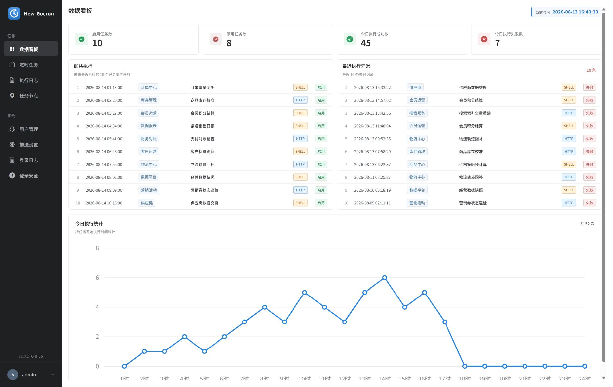
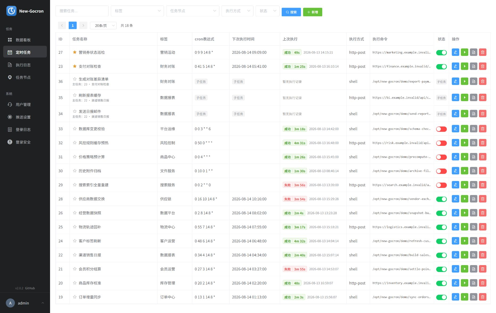
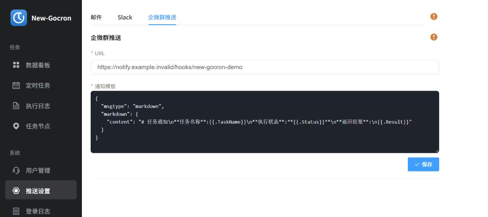

# New-Gocron

New-Gocron 基于 [ouqiang/gocron](https://github.com/ouqiang/gocron) 二次开发。感谢原作者及社区贡献者提供稳定的任务调度基础。本项目在保留原有 Shell、HTTP、任务依赖、多节点和通知能力的基础上，持续完善管理界面、数据看板、任务操作、登录安全及发布流程。

当前版本为 **2.0.3**，支持 MySQL 和 PostgreSQL，可通过二进制包部署，也可从源码构建。

## 界面预览

### 数据看板



### 定时任务



### 推送设置



## 主要功能

- 集中管理 Shell 与 HTTP 定时任务，支持多节点、子任务、失败重试和手动执行。
- 提供任务状态、今日执行趋势、即将执行任务和最近异常的数据看板。
- 支持按任务、标签、节点、执行方式和状态筛选，并可在当前浏览器按用户保存置顶任务。
- 支持邮件、Slack 和企业微信 Webhook 通知，以及关键字、通配符、正则表达式和数值比较规则。
- 提供登录失败审计、按 IP 与账号封禁、后台 IP 白名单和数据库升级工具。

## 更新说明

当前版本新增多企微群与多通知模板配置，完成定时任务页面的移动端适配，并完善一键安装、升级和节点安全说明。完整版本记录（含上游 gocron 历史版本概要）请查看 [CHANGELOG.md](CHANGELOG.md)。

## 二进制部署

### Linux 一键安装

以下命令会从 GitHub 获取最新发行版，校验 SHA-256，安装到 `/usr/local/gocron`，创建 systemd 服务并启动 Web 管理端：

```bash
curl -fsSL https://raw.githubusercontent.com/caoyek/New-Gocron/main/scripts/install.sh | sudo bash
```

同时安装任务节点：

```bash
curl -fsSL https://raw.githubusercontent.com/caoyek/New-Gocron/main/scripts/install.sh | sudo bash -s -- --with-node
```

一键安装默认使用受限系统用户 `new-gocron` 运行 Web 主程序和任务节点。需要系统权限或访问 `/root` 目录的 Shell 任务，可显式启用 root 节点：

```bash
curl -fsSL https://raw.githubusercontent.com/caoyek/New-Gocron/main/scripts/install.sh | sudo bash -s -- --with-node --node-root
```

节点运行方式会在后续升级时保持不变。使用 `--node-unprivileged` 可切回 `new-gocron`。root 节点可执行任意系统命令，请仅允许可信管理员编辑任务，并通过防火墙限制 `5921` 端口的访问范围。

### 更新现有安装

仅更新 Web 主程序：

```bash
curl -fsSL https://raw.githubusercontent.com/caoyek/New-Gocron/main/scripts/install.sh | sudo bash -s -- --upgrade --without-node
```

同时更新 Web 主程序和任务节点：

```bash
curl -fsSL https://raw.githubusercontent.com/caoyek/New-Gocron/main/scripts/install.sh | sudo bash -s -- --upgrade --with-node
```

将现有任务节点改为 root 并更新：

```bash
curl -fsSL https://raw.githubusercontent.com/caoyek/New-Gocron/main/scripts/install.sh | sudo bash -s -- --upgrade --with-node --node-root
```

更新默认针对 `/usr/local/gocron`，并保留 `conf/`、`log/` 和 `backups/`。更新前的程序和配置会备份到 `backups/` 目录。

支持从 gocron 1.5.3 升级到 New-Gocron 2.0.x：脚本会保留旧配置，并在首次启动时执行数据库迁移。使用标准 `gocron.service` 的旧版会被自动停止和接管；如果旧版由 Supervisor、Docker、宝塔或 `nohup` 管理，请先停止旧进程再运行更新命令。

指定版本或自定义目录可使用：

```bash
curl -fsSL https://raw.githubusercontent.com/caoyek/New-Gocron/main/scripts/install.sh | \
  sudo bash -s -- --version v2.0.3 --install-dir /data/new-gocron
```

默认安装目录为 `/usr/local/gocron`，安装过程记录在 `/var/log/new-gocron-install.log`。首次启动后访问 `http://服务器IP:5920` 完成数据库和管理员配置。

### 手动安装

从 [Releases](https://github.com/caoyek/New-Gocron/releases) 下载对应系统的程序包并解压。运行目录至少需要包含以下内容：

```text
gocron
gocron-node
conf/
```

Windows 程序文件名为 `gocron.exe` 和 `gocron-node.exe`。

### 启动 Web 服务

Linux：

```bash
chmod +x gocron
./gocron web
```

Windows：

```powershell
.\gocron.exe web
```

Web 服务默认监听 `0.0.0.0:5920`。可按需指定地址、端口和运行环境：

```bash
./gocron web --host 0.0.0.0 --port 5920 --env prod
```

首次部署时访问 `http://服务器IP:5920`，根据安装页面完成数据库配置。安装后的配置保存在 `conf/app.ini`。

### 启动任务节点

Shell 任务需要至少一个可用的任务节点。请在实际执行命令的服务器上启动 `gocron-node`。

Linux：

```bash
chmod +x gocron-node
./gocron-node
```

Windows：

```powershell
.\gocron-node.exe
```

任务节点默认监听 `0.0.0.0:5921`，指定监听地址可使用：

```bash
./gocron-node -s 0.0.0.0:5921
```

启动后在 New-Gocron 的“任务节点”页面添加节点地址。

## 从旧版本升级

New-Gocron 2.0 相对原项目涉及以下数据库字段调整：

| 表 | 字段 | 原类型或异常类型 | New-Gocron 2.0 类型 |
| --- | --- | --- | --- |
| `{prefix}task` | `command` | `VARCHAR(256)` | `TEXT NOT NULL` |
| `{prefix}task_log` | `command` | `VARCHAR(256)` | `TEXT NOT NULL` |
| `{prefix}task` | `notify_keyword` | `VARCHAR(128)` | `TEXT NOT NULL` |
| `{prefix}task` | `deleted` | 部分异常数据库为数值类型 | MySQL `DATETIME NULL` / PostgreSQL `TIMESTAMP NULL` |

登录安全功能还会新增两张表：

| 表 | 用途 |
| --- | --- |
| `{prefix}login_security_event` | 保存所有登录成功和失败事件 |
| `{prefix}login_block` | 保存 IP 和账号的封禁状态 |

登录安全策略保存在已有的 `{prefix}setting` 表中，`code` 为 `login_security`，`key` 为 `policy`。

其中 `{prefix}` 是 `conf/app.ini` 中 `db.prefix` 配置的表前缀。前缀会直接与表名拼接，例如 `db.prefix = gocron` 对应的任务表为 `gocrontask`。

推荐按以下顺序升级生产环境：

1. 备份当前数据库和 `conf/app.ini`。
2. 停止旧版 Web 服务，避免升级过程中继续写入数据。
3. 解压 New-Gocron 2.0.3，并保留原有的 `conf/app.ini`、`conf/install.lock` 和 `conf/.version`。
4. 在 New-Gocron 程序目录执行数据库升级命令。
5. 数据库升级成功后再启动 Web 服务和任务节点。

Linux：

```bash
./gocron db-upgrade
./gocron web
```

Windows：

```powershell
.\gocron.exe db-upgrade
.\gocron.exe web
```

`db-upgrade` 会读取程序目录中的 `conf/app.ini`，执行 New-Gocron 2.0 所需的字段调整并创建登录安全数据表，不启动 Web 服务或任务调度。该命令可以重复执行。

正常从旧版本首次启动 New-Gocron 2.0 时也会进入版本迁移流程，但生产环境建议先单独执行 `db-upgrade`，确认数据库升级成功后再启动服务。

> 不要在未备份数据库的情况下直接升级，也不要让旧版 Web 服务长期连接已经完成 2.0 字段调整的数据库。

## 源码开发

### 环境准备

- Go（项目使用 Go Modules）
- Node.js 16.20.2（仓库提供 `.node-version`，可使用 fnm 切换）
- npm 或 Yarn
- MySQL 或 PostgreSQL

克隆项目：

```bash
git clone https://github.com/caoyek/New-Gocron.git
cd New-Gocron
```

使用 fnm 准备前端环境：

```bash
fnm install
fnm use
```

### 后端和任务节点

编译两个程序：

```bash
make
```

编译结果位于 `bin/`：

```text
bin/gocron
bin/gocron-node
```

编译并以开发模式启动后端和任务节点：

```bash
make run
```

也可以分别启动：

```bash
./bin/gocron web --env dev
./bin/gocron-node
```

### 前端

安装依赖并启动开发服务器：

```bash
cd web/vue
npm install
npm run dev
```

前端开发地址为 `http://localhost:8080`，`/api` 请求会代理到本地后端 `http://localhost:5920`。

也可以在项目根目录使用 Makefile：

```bash
make install-vue
make run-vue
```

### 测试与打包

运行 Go 测试：

```bash
go test ./...
```

在 Windows 本地生成 Linux、Windows amd64 完整发布包：

```powershell
.\scripts\package-release.ps1 -Version v2.0.3
```

Linux 或 macOS 可使用 Make：

```bash
make package VERSION=v2.0.3
```

两个入口都会构建前端、更新内嵌静态资源、运行 Go 测试，并在 `dist/` 生成 Windows/Linux 主程序、节点程序和 `SHA256SUMS.txt`。本地构建只生成文件，不会自动上传 GitHub。

### GitHub Actions 自动构建

- 推送 `main`：自动测试并生成 Actions Artifact，不创建 Release。
- 在 Actions 页面手动运行：生成测试 Artifact，不创建 Release。
- 推送 `v*` 标签：自动测试、编译并创建或更新对应的 GitHub Release。

正式发布示例：

```bash
git push origin main
git tag v2.0.3
git push origin v2.0.3
```

需要中文发行说明时，在推送标签前新增 `docs/releases/v2.0.3.md`。工作流会把该文件放在 Release 正文顶部，并在下方追加 GitHub 根据提交和 PR 自动生成的变更记录；未提供该文件时则只使用自动生成内容。

本地和 GitHub 可以同时编译，但正式 Release 的同名资产建议只由 GitHub Actions 上传，避免并发覆盖。

## 常用端口

| 服务 | 默认地址 | 用途 |
| --- | --- | --- |
| Web 服务 | `0.0.0.0:5920` | 管理页面和 API |
| 任务节点 | `0.0.0.0:5921` | 接收并执行 Shell 任务，仅允许 Web 主程序服务器访问 |
| 前端开发服务 | `localhost:8080` | Vue 开发与热更新 |

## 配置与数据安全

- 主配置文件为 `conf/app.ini`，不要将生产数据库密码提交到 Git。
- 升级或迁移前必须备份数据库和配置文件。
- 从线上数据库复制数据到开发环境后，应先停用所有任务，避免开发环境误执行线上任务。
- 生产环境必须在云安全组和主机防火墙中将任务节点 `5921` 端口的入站来源限制为 Web 主程序服务器的固定 IP，禁止向 `0.0.0.0/0` 开放。同机部署应让任务节点只监听 `127.0.0.1:5921`。
- IP 白名单是任务节点的最低安全前提，但不提供传输加密，也不能防止 Web 主程序服务器失陷后的调用；跨公网通信建议同时启用 TLS。
- 生产环境建议使用进程管理工具托管 `gocron web` 和 `gocron-node`。
- 如果 Web 服务经过 Nginx、Caddy 等反向代理，应在代理或防火墙层同时配置后台 IP 白名单；应用层默认使用 TCP 对端 IP，不信任可伪造的请求头。

## 问题反馈

请在 [New-Gocron Issues](https://github.com/caoyek/New-Gocron/issues) 提交问题，并附上版本、操作系统、数据库类型和相关日志。

## 项目来源与许可证

New-Gocron 基于 [ouqiang/gocron](https://github.com/ouqiang/gocron) 二次开发。原项目的功能说明、架构资料和历史版本记录请查看原项目仓库，本项目不再重复收录。

本项目继续保留原项目的开源许可证和版权声明，具体内容见 [LICENSE](LICENSE)。
